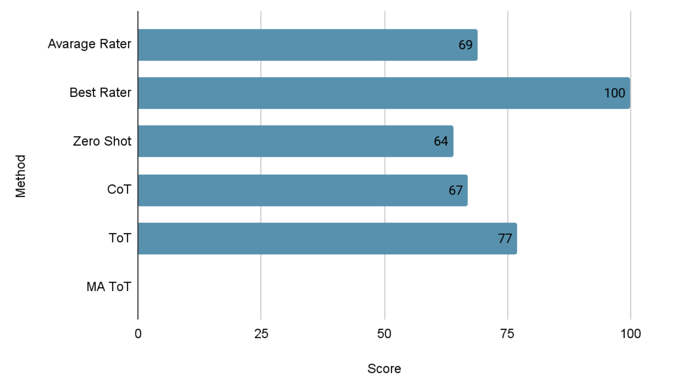

# Executive Summary 

## Project Overview:
This integrative project, presented by José Alberto Mtanous Treviño under the guidance of Dr. Luis Eduardo Falcón Morales and Mazal Bethany, focuses on enhancing causal reasoning in large language models (LLMs). The project's primary aim is to address the limitations of LLMs in distinguishing between correlation and causation.

## Background on Causal Reasoning and Challenges:
Causal reasoning allows models to identify and understand cause-and-effect relationships rather than simply identifying patterns or correlations. Traditional LLMs struggle with causal inference because the training data lacks explicit causal sequences, making it challenging to interpret causality accurately.

## Methodology and Tools:
1. BIG-bench Benchmark and Causal Judgment Task: This benchmark evaluates the ability of LLMs to understand causality through various tasks. The project specifically focuses on the Causal Judgment task, which assesses the model's skill in identifying causative relationships between events.

2. Experimental Techniques:
   - Zero-shot: Direct query response, achieving a baseline accuracy of 62%.
   - Chain of Thought (CoT): Step-by-step reasoning, improving accuracy to 64%.
   - Tree of Thought (ToT): This innovative technique generates multiple reasoning branches, enabling the model to explore alternative solutions. The approach improved task performance to 77%, significantly surpassing baseline methods. 

## Implementation Details:
The project developed a Python framework and utilized the GPT-4o-mini model with standard parameters. The code is publicly accessible, allowing for reproducibility and further development. Each method’s performance and prompt details are documented.

## Findings and Comparison:
The ToT technique notably outperformed the other methods (13% over zero-shot and 10% over CoT), showcasing potential for complex causal reasoning tasks. However, it requires substantial computational resources and careful prompt tuning, using approximately ten times more tokens than CoT or zero-shot methods.

## Conclusion and Future Work:
The project concludes that ToT can significantly enhance causal reasoning in LLMs, though it requires prompt optimization. Future work will explore multi-agent ToT structures and automated prompt tuning to further refine performance. 

## Resources:
Code and detailed results are available on the project’s GitHub repository: https://github.com/a00169781/proyecto-integrador/

## References

- google. (2021). BIG-bench/bigbench/benchmark_tasks/causal_judgment at main · google/BIG-bench. GitHub. https://github.com/google/BIG-bench/tree/main/bigbench/benchmark_tasks/causal_judgment
- Haji, F., Bethany, M., Tabar, M., Chiang, J., Rios, A., & Najafirad, P. (n.d.). Improving LLM Reasoning with Multi-Agent Tree-of-Thought Validator Agent. Retrieved September 22, 2024, from https://arxiv.org/pdf/2409.11527
